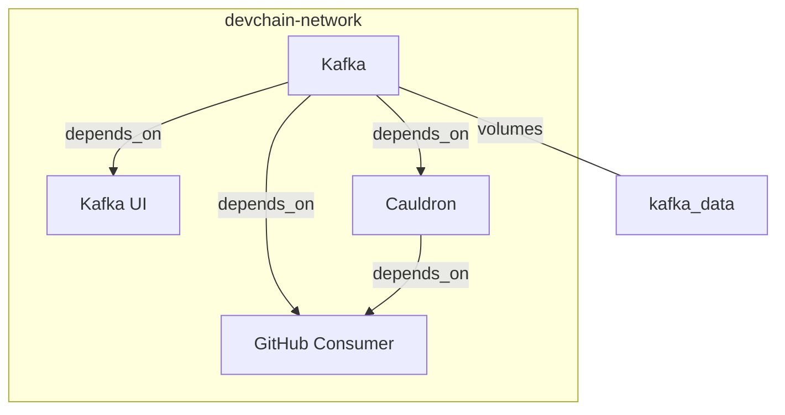

# Development

@wip

## Requirements

To run, test or develop on your local machine, it’s better to install the
following requirements. Docker compose file is also provided, includes
all the required services.

- `go` - current version: `1.23.4`
- `postgresql` - version `16` or higher
- `pre-commit` - optional, use `pre-commit install` if you plan to contribute!
- `direnv` - optional, recommended, manages your environment variables over `.envrc`
- `docker` - optional, recommended, you can run external/all services with `docker-compose`
- `ngrok` or equivalent tool if you want to receive webhooks locally.

If you add `rake task` please use `robocop` for linting `Rakefile`:

```bash
# bundler required
# use:
# gem install --user-install bundler
# to install. then;
bundle config set --local path 'ruby-vendor/bundle' --local bin 'bin'
bundle
```

## Environment Variables

| Variable | Description | Default |
|:---------|:------------|---------|
| `LISTEN_ADDR` | Server listen address | `":8000"` |
| `LOG_LEVEL` | Logging level, Valid values are: `"DEBUG"`, `"INFO"`, `"WARN"`, `"ERROR"` | `"INFO"` |
| `GITHUB_HMAC_SECRET` | HMAC secret value for GitHub’s webhooks. | `""` |
| `KCP_TOPIC_GITHUB` | Kafka consumer/producer topic name for GitHub Webhooks | `""` |
| `KCP_BROKERS` | Kafka consumer/producer brokers list, comma separated | `"127.0.0.1:9094"` |
| `KP_PRODUCER_QUEUE_SIZE` | Size of default Kafka message producer queue size | `100` |
| `KC_PARTITION` | Consumer partition number | `0` |
| `KC_TOPIC` | Topic to subscribe | `""` |
| `KCP_BROKERS` | Kafka consumer/producer brokers list, comma separated | `"127.0.0.1:9094"` |
| `KC_DIAL_TIMEOUT` | Initial connection timeout used by broker | "`30s`" (seconds) |
| `KC_READ_TIMEOUT` | Response timeout used by broker | "`30s`" (seconds) |
| `KC_WRITE_TIMEOUT` | Transmit timeout used by broker | "`30s`" (seconds) |
| `KC_BACKOFF` | Backoff value for retries | "`2s`" (seconds) |
| `KC_MAX_RETRIES` | Maximum retry | `10` |

Example `.envrc`:

```bash
# for ruby/rake only
export PATH="bin:${PATH}"

export LISTEN_ADDR=":8000"
export LOG_LEVEL="INFO"
export GITHUB_HMAC_SECRET="<secret>"

# kafka consumer/producer shared values.
export KCP_TOPIC_GITHUB="github"
export KCP_BROKERS="127.0.0.1:9094"

# kafka producer values.
export KP_PRODUCER_QUEUE_SIZE=100

# kafka github consumer values.
export KC_PARTITION="0"
export KC_TOPIC="${KCP_TOPIC_GITHUB}"
export KC_DIAL_TIMEOUT="30s"
export KC_READ_TIMEOUT="30s"
export KC_WRITE_TIMEOUT="30s"
export KC_BACKOFF="2s"
export KC_MAX_RETRIES="10"
```

## Clonse source for development

```bash
cd /path/to/development
git clone git@github.com:devchain-network/cauldron.git
cd cauldron/
go mod download
```

### Rake Tasks

If `ruby` is installed or available on your machine, use `rake tasks`:

```bash
rake -T

rake default                       # default task, runs server
rake docker:build:github_consumer  # build github consumer
rake docker:build:server           # build server
rake docker:compose:infra:down     # stop the infra with all components
rake docker:compose:infra:up       # run the infra with all components
rake docker:compose:kafka:down     # stop the kafka and kafka-ui only
rake docker:compose:kafka:up       # run the kafka and kafka-ui only
rake docker:run:github_consumer    # run github consumer
rake docker:run:server             # run server
rake run:kafka:github:consumer     # run kafka github consumer
rake run:server                    # run server
```

### Infra



Webhook server runs via:

```bash
go run cmd/server/main.go  # or,
rake                       # run with rake task
```

GitHub kafka consumer runs via:

```bash
go run cmd/githubconsumer/main.go   # or,
rake run:kafka:github:consumer      # run with rake task
```

Now, run the kafka + kafka-ui via:

```bash
docker compose -f docker-compose.kafka.yml up    # or,
rake docker:compose:kafka:up                     # run with rake task
```

Instead of running each service independently, use:

```bash
docker compose -f docker-compose.infra.yml up    # or,
rake docker:compose:infra:up
```

You can access kafka-ui from:

http://127.0.0.1:8080/

Logging for kafka and kafka-ui is set to `error` only. Due to development
purposes, both were producing too much information, little clean up required.
