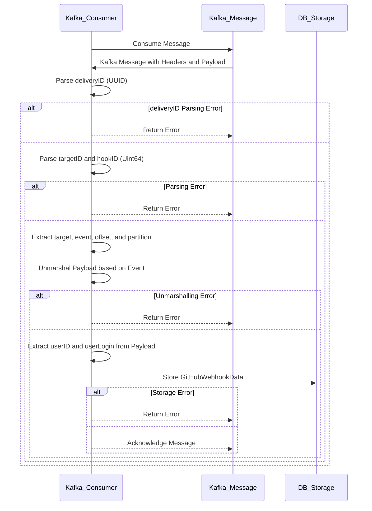

# Sequence Diagrams

- Webhook Server
- GitHub Consumer

---

## Webhook Flow

```mermaid
sequenceDiagram
    participant Client
    participant Webhook_Server
    participant Kafka_Producer

    Client->>Webhook_Server: HTTP Request
    alt Path Not Known
        Webhook_Server-->>Client: 404 Not Found
    else Method Not Allowed
        Webhook_Server-->>Client: 405 Method Not Allowed
    else Path = "/v1/webhook/github" and Method = POST
        Webhook_Server->>Webhook_Server: Check HTTP Headers
        alt Missing X-Github-Delivery
            Webhook_Server-->>Client: 400 Bad Request
        else
            Webhook_Server->>Webhook_Server: Parse Payload and Validate Signature
            alt Payload Parsing or Signature Validation Error
                Webhook_Server-->>Client: 400 Bad Request
            else
                Webhook_Server->>Webhook_Server: Marshal Parsed Struct to JSON
                alt JSON Marshaling Error
                    Webhook_Server-->>Client: 500 Internal Server Error
                else
                    Webhook_Server->>Kafka_Producer: Create Kafka Message (Buffered Channel)
                    Kafka_Producer-->>Webhook_Server: Message Acknowledged
                    Webhook_Server-->>Client: 202 Accepted
                end
            end
        end
    end
```

---

## GitHub Consumer

```mermaid
sequenceDiagram
    participant Kafka_Consumer
    participant Kafka_Message
    participant DB_Storage

    Kafka_Consumer->>Kafka_Message: Consume Message
    Kafka_Message->>Kafka_Consumer: Kafka Message with Headers and Payload

    Kafka_Consumer->>Kafka_Consumer: Parse deliveryID (UUID)
    alt deliveryID Parsing Error
        Kafka_Consumer-->>Kafka_Message: Return Error
    else
        Kafka_Consumer->>Kafka_Consumer: Parse targetID and hookID (Uint64)
        alt Parsing Error
            Kafka_Consumer-->>Kafka_Message: Return Error
        else
            Kafka_Consumer->>Kafka_Consumer: Extract target, event, offset, and partition
            Kafka_Consumer->>Kafka_Consumer: Unmarshal Payload based on Event
            alt Unmarshalling Error
                Kafka_Consumer-->>Kafka_Message: Return Error
            else
                Kafka_Consumer->>Kafka_Consumer: Extract userID and userLogin from Payload
                Kafka_Consumer->>DB_Storage: Store GitHubWebhookData
                alt Storage Error
                    Kafka_Consumer-->>Kafka_Message: Return Error
                else
                    Kafka_Consumer-->>Kafka_Message: Acknowledge Message
                end
            end
        end
    end
```